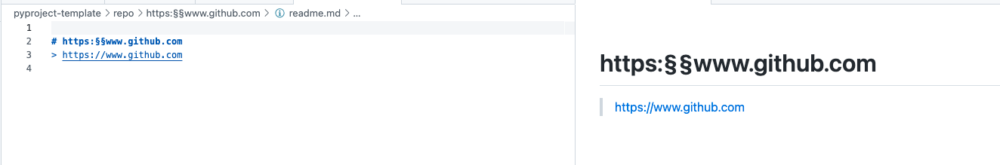

# pyproject-template

simple pyproject template with some factories and potery and linters

### Installation

* Install Poetry: <https://python-poetry.org/docs/#installation>
* Activate virtual env: `pyenv activate py37pyproject`
* Install package and dependencies: `poetry install`
* Install pre-commit hooks: `poetry run pre-commit install`

### Run pre-commit hooks manually

All pre-commit hooks will be run automatically when pushing changes.
They can also be run on staged files or on all files manually:

```bash
# Run all hooks against currently staged files,
# this is what pre-commit runs by default when committing:
pre-commit run

# Run all the hooks against all the files:
pre-commit run --all-files

# Run a specific hook against all staged files:
pre-commit run black
pre-commit run flake8
pre-commit run isort
pre-commit run pylint
```

### Continuous pytest

```bash
export PYTHONPATH=. && ptw -c  -- --capture=tee-sys -o log_cli=true
```

## Sample usage to take notes
> I added some simple functionality just to make this doing something :P

```bash
cd pyproject-template/
mkdir myrepo && cd myrepo
cp ../tests/resources/map.yaml .
export CONFIG_FILE=$(pwd)/map.yaml
cat $CONFIG_FILE
```

```bash
python ../main.py help
```
```
(pyproject-template.git) √ pyproject-template % python main.py help
__version__ = "0.0.0"
['create_section', 'help']
```

```bash
hh='https://www.github.com'
python ../main.py create_section $hh
```
```
ls -1
https:§§www.github.com
map.yaml
```


and so on you can add a placeholder for taking notes
